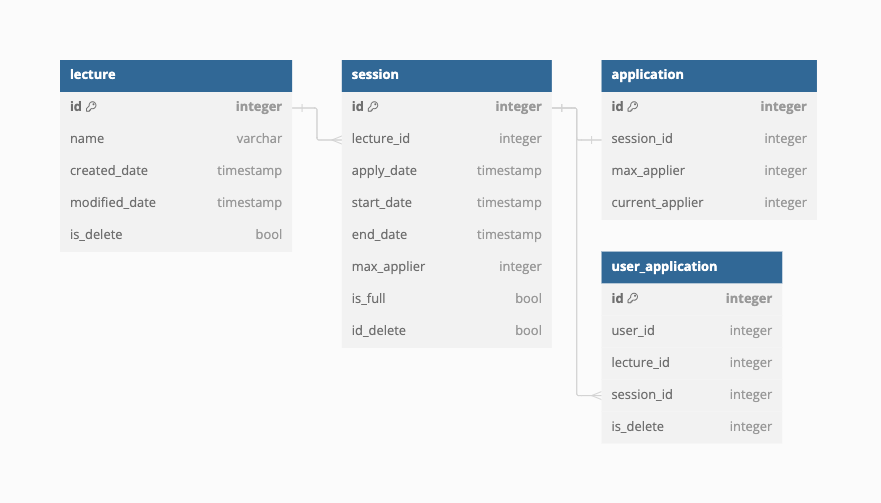
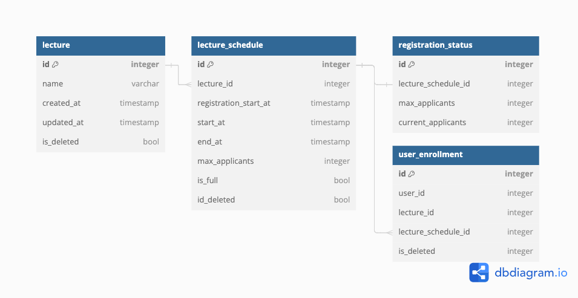

# 특강신청 서비스

## ERD

- lecture : 강의 정보
- lectureschedule : 강의 스케줄 정보
- registrationstatus : 수강 현황 정보
- user-registrationstatus : 유저의 강의 신청 정보

### v1

### v2

Web link : https://dbdocs.io/gogodnjsdn/hh99-lecture-apply?view=relationships